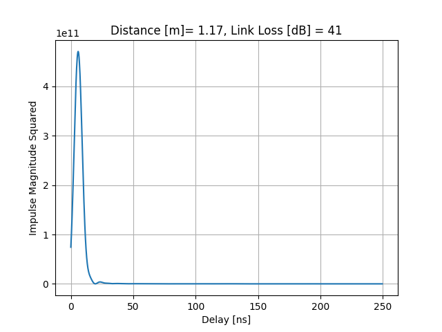

# Nordic distance toolbox example

## Background
Nordic has released [Nordic Distance Toolbox](https://github.com/nrfconnect/sdk-nrfxlib/tree/main/nrf_dm) and some sample apps in Nordic
Connect SDK.

Although it's possible to use the examples, I'm more of a barebone guy. With the
NDT, it's possible to get the I and Q tones from the multi-carrier phase
difference measurement, and thus, it's possible to play with them.

For example, estimating the impulse response between two devices 

    python3 py/plot.py impulse --com /dev/tty.usbmodem0006857014091




## Getting started

You need [Nordic Connect
SDK](https://developer.nordicsemi.com/nRF_Connect_SDK/doc/latest/nrf/index.html)

Once everything is installed, then you should be able to do

    make first
    
    
And look in the Makefile for the rest


## How it works

The code is made for nRF52833DK, so you need two of those.

The reflector code (reflector/src/main.c) must be flashed to one kit
    
    make flashr

The initiator code (initiator/src/main.c) must be flashed to another kit

    make flashi
    
The initiator will wait for a character on UART (any character). Then,
it will execute a ranging procedure, and afterwards dump json version of the
`nrf_dm_report_t` to the terminal


``` json
{"i_local": [0, 0, 0, 0, -7319, -7313, 4926, -6128, -316, -6474, 7072, -4938, -6043, 6389, 6451, 1381, -43, 1325, -5936, 5771, -2543, 294, 1164, -2840, -2087, 1769, 5671, -721, 3287, 2414, 3323, -2681, 502, -3325, 4849, 4444, -4889, 401, -4510, -4476, 3529, -3800, -4655, -912, -2990, -1097, 103, 4481, 4393, 1313, 2873, -363, -2859, -3791, -3363, -3471, 4228, -3889, 3721, -1410, 2003, 3972, -1836, -4289, 4037, -4360, -2153, 4321, -4289, 1402, -3008, 3359, -1563, -4496, -4156, 3462, -4343, 4222, 4669, 0], "q_local": [0, 0, 0, 0, -364, -61, 5351, 3895, -7200, 3021, -467, -5019, -3498, 2597, -2164, 6584, -6651, 6433, 2540, 2679, -5738, 6155, -5974, 5254, -5507, 5512, 187, -5556, -4430, 4817, -4196, 4518, -5164, -3922, 1418, -2230, -715, -4866, -1788, -1699, -3170, -2773, 154, 4517, 3464, -4430, 4527, -75, 790, -4252, 3371, 4407, -3372, -2217, -2750, 2586, 945, -1886, 2135, -4063, -3829, 1589, -3897, 405, 1644, 232, 3838, 924, -1293, 4290, 3400, -3106, 4343, -1094, 2077, -3096, 1719, 2030, -728, 0], "i_remote": [0, 0, 0, 0, 5710, 5989, -7324, 3591, 3350, 5030, -6847, 5855, 6503, -6543, -6564, -464, -1542, 438, 6411, -4283, -300, 3063, -4365, 5485, -2258, 2487, -3862, -3738, -5358, 2812, -5129, 5100, -4618, -2281, -600, -3515, 853, -4604, -651, -749, -3645, -2250, 347, 4398, 3497, -4295, 4352, 430, 1171, -3933, 3643, 4112, -3764, -2842, -3281, 1332, 2355, -3110, 3499, -4108, -2476, 3362, -4141, -1953, 3553, -2523, 1715, 3466, -3766, 3917, -91, 1166, 993, -4326, -2630, 1970, -3471, 4563, 4217, 0], "q_remote": [0, 0, 0, 0, 5040, 4644, 1654, 6545, -6608, 5305, -2380, -4142, -2668, 2403, -2024, 6733, -6474, 6522, 296, 4674, -6221, 5276, -4122, 2141, -5334, 5117, 4011, -4005, -187, 4442, 762, -196, -2027, -4395, 4849, 3287, -4688, -1033, -4621, -4555, 2730, -3930, -4468, -576, -2671, -932, -1, 4328, 4128, 1713, 2240, -1044, -1951, -3124, -2609, -3957, 3450, -2756, 2266, 603, 3341, 2447, 338, -3732, 2254, -3444, -3951, 2590, -2201, -2038, -4478, 4345, -4428, -1417, -3742, 4171, -3030, -869, 1984, 0], "ifft[mm]": 1096, "phase_slope[mm]": 1522, "rssi_openspace[mm]": 501, "best[mm]": 1096, "link_loss[dB]": 34, "rssi_local[dB]": 27, "rssi_remote[dB]": 26, "txpwr_local[dB]": 8, "txpwr_remote[dB]": 8, "quality": 0}
```

The `py/plot.py` can read the JSON directly from device, or from file to produce plots.

    python3 py/plot.py impulse --com /dev/tty.usbmodem0006857014091

## Support

Don't expect any, but at the same time, don't be afraid to ask.


